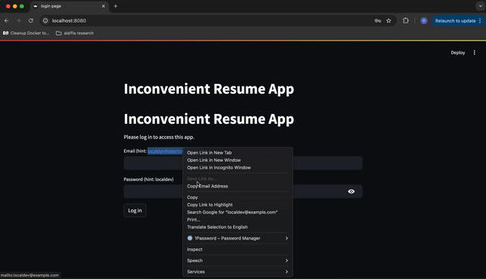
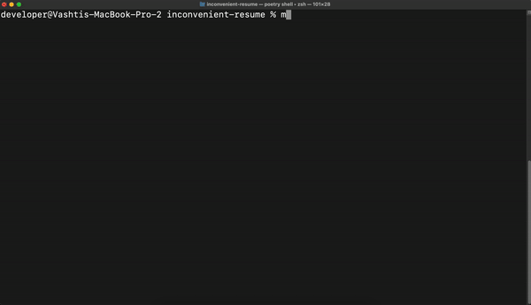
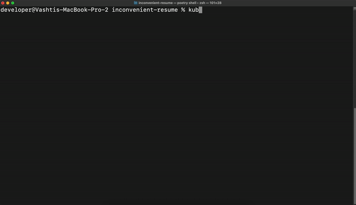

# Gage Russell: the most inconvenient way to get my resume 💌

## Description
This is a **kubernetes local development environment** using kind to host:
* **REST API** [README](./inconvenient_resume_api/README.md)
* **Web App** [README](./inconvenient_resume_app/README.md)
* **Postgresql**
All to show you my resume .... **the most inconvenient way to show you my resume**. 🫠

**Please note**: This was thrown together for fun on a saturday evening to dust off some cobwebs and add some fun to updating my resume. This would need a little more time to work seamlessly .. and time is not easily found. -- Noticing some transient request errors when running inside cluster. Thinking this might be related to overwhelming amount of liveness probe checks to single instance API service, but have not invesitgated at all. Re-clicking buttons seems to resolve the issue. Something to come back and play with another day.

### Demo

### Kind Cluster Creation & Deployment

### Kind Cluster Tour

## Prereqs
* docker must be installed
* kind must be installed
* kubectl must be installed
* helm must be installed

## Setup

### Easy
1. `make start-all`

### Detailed
Dig through the [Makefile](./Makefile) for details.
1. `make start-cluster`
2. `make build-api`
3. `make build-app`
4. `make deploy-umbrella-chart`
5. **not quite working** `make setup-ingress`
    * instead port-forward the App service
        * `kubectl port-forward inconvenient-resume-app-xyz-xyz 8080:8080`
6. `make destroy`

### Easiest
just go download my [resume](./inconvenient_resume_api/inconvenient_resume_api/assets/gage_russell_resume.pdf) ... but that's no fun ..

## TODO
* ingress
    * Figure out how to setup ingress and host mapping with kind cluster correctly instead of port forwarding
* chart refinement
    * definitely dusting off some cobwebs here
* move migrations into init container
    * until then I've got a race condition between API and database ... but database in deployed environment wouldn't be in the cluster anyways
    * but I guess it's okay, because the API pod will just restart until it successfully runs its migrations
* plenty of other stuff ... just having fun killing a Saturday evening though.
